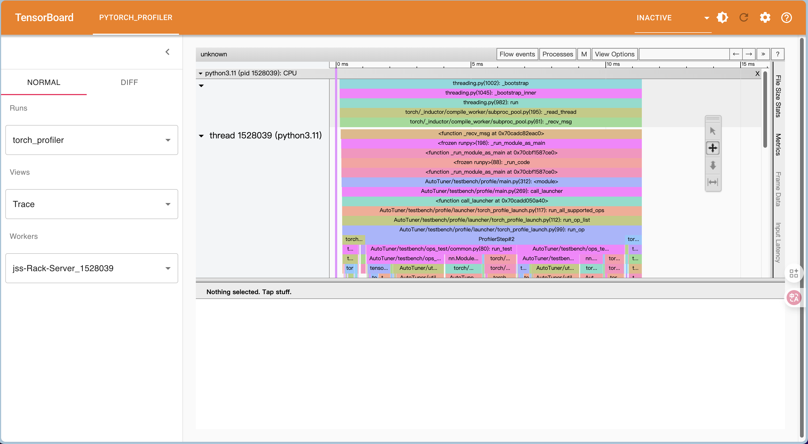
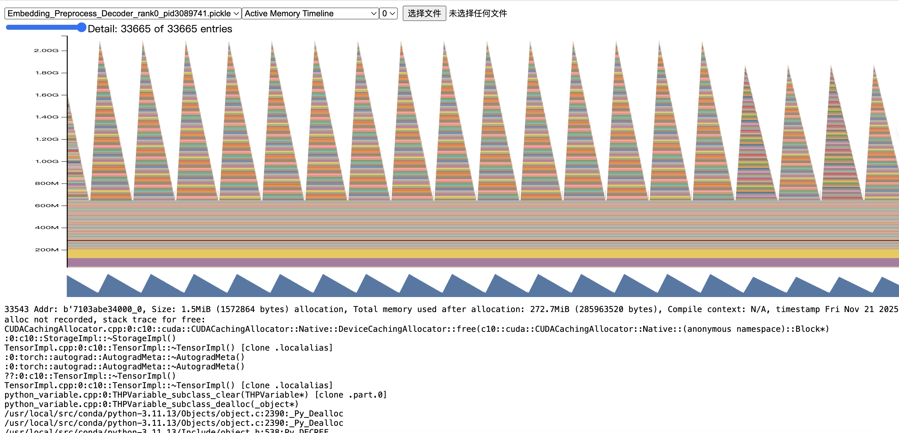
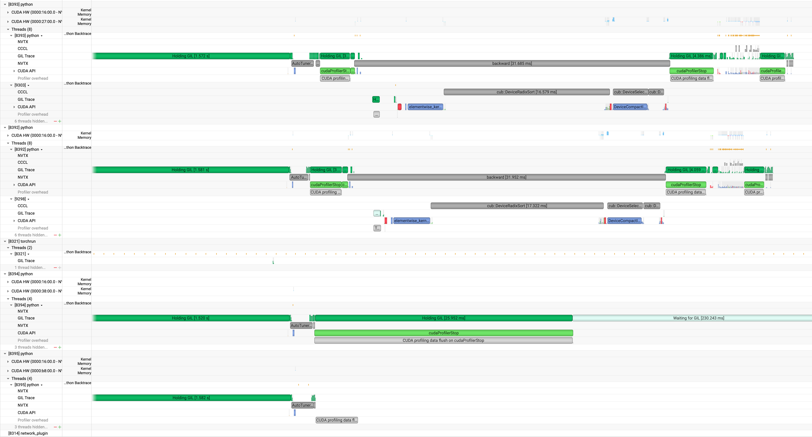

# Quick Start

## Pre-Requirements

Follow the [install guides](./Install.md)

Follow [.secrets/env_sample.sh](../.secrets/env_sample.sh), create an `env.sh` in the same directory to hold your config.

Follow [tests/functional_test/test_env_sample.sh](../tests/functional_test/test_env_sample.sh), create an `test_env.sh` in the same directory to hold your testing config.

Follow [AutoTuner/testbench/profile/configs/local/README.md](../AutoTuner/testbench/profile/configs/local/README.md)

## To Try Collect Data

Run [tests/functional_test/testbench_collect_data.sh](../tests/functional_test/testbench_collect_data.sh), modify the configs to follow your environment.

The outputs like:

```sh
(megatron-lm-autotuner) ➜  Megatron-LM-AutoTuner git:(main) ls outputs/2025-10-15_17-48-12/Qwen/Qwen3-0.6B/collect_data                  
rank_0  rank_1  rank_2  rank_3
```

Theoretical weights, activations, and FLOPS are generated synchronously (profile-mode=0) and inserted into memory_activation.json, memory_weights.json, timing.json alongside real values (format: {"real": "...", "estimated": "..."}).

Optional CLI args: 

```sh
--theoretical-flops true # Enable FLOPS estimation
--theoretical-activations false # Disable activation estimation
```

Default behavior: Weights estimation enabled; activations estimation enabled; FLOPS estimation disabled.

Built on the TheoreticalCalculation abstract base class (in `AutoTuner/testbench/ops_test/theoretical_base.py`), with per-op implementations integrated into data collection.

## To Try Torch Profiler

Run [tests/functional_test/testbench_torch_profile.sh](tests/functional_test/testbench_torch_profile.sh), modify the configs to follow your environment.

After finish, you can check output dir:

```sh
(megatron-lm-autotuner) ➜  Megatron-LM-AutoTuner git:(main) ✗ ls outputs/2025-10-17_16-22-50/Qwen/Qwen3-0.6B/torch_profiler                                                        
jss-Rack-Server_1528039.1760689383431851581.pt.trace.json  jss-Rack-Server_1528040.1760689383437475633.pt.trace.json  jss-Rack-Server_1528041.1760689383439235537.pt.trace.json  jss-Rack-Server_1528042.1760689383440949434.pt.trace.json
```

Then run:

```
pip install torch_tb_profiler

tensorboard --logdir=outputs/2025-10-17_16-22-50/Qwen/Qwen3-0.6B/torch_profiler --host 0.0.0.0
```

Open your browser and go to `http://[ip]:6006/#pytorch_profiler`, you will see the traces in `Views` tabs, use `WASD` to check the traces.



Memory snapshot is saved to memory_snapshot/ directory under the same trace output path after all ops execution.  
For single op snapshot, specify one op in TEST_OPS_LIST of tests/functional_test/test_env.sh.  
Visualize snapshots via https://docs.pytorch.org/memory_viz



Backed by verl.utils.memory_utils (imported in `AutoTuner/testbench/profile/launcher/torch_profile_launch.py`), triggered after run_op_list execution.

## To Try Nsys Profiler

**NOTE: This function requires to use docker: `whatcanyousee/megatron-autotuner-env:mcore0.14.0_te2.7`, since nsys can only work in root mode.**

1. Launch docker:

```bash
docker create --rm -it --gpus all --shm-size=25GB --name megatron_autotuner -v $(pwd):/workspace/Megatron-LM-AutoTuner --network=host --cap-add SYS_ADMIN whatcanyousee/megatron-autotuner-env:mcore0.14.0_te2.7

docker start megatron_autotuner

docker exec -it megatron_autotuner bash

# in container
bash scripts/install_in_docker.sh
```

2. In docker container, Update Nsight System:

```
aria2c https://developer.nvidia.com/downloads/assets/tools/secure/nsight-systems/2025_6/NsightSystems-linux-cli-public-2025.6.1.190-3689520.deb
```

Then execute:

```bash
cd Megatron-LM-AutoTuner

cd verl && pip install --no-deps -e . && cd ..

bash tests/functional_test/testbench_nsys_profile.sh
```

3. In your local Mac/PC, download [nsight compute](https://developer.nvidia.com/tools-overview/nsight-compute/get-started)

Open profiled file in path: `outputs/[TIMESTAMP]/Qwen/Qwen3-0.6B/nsys_profile/nsight_report.nsys-rep`

Result:


