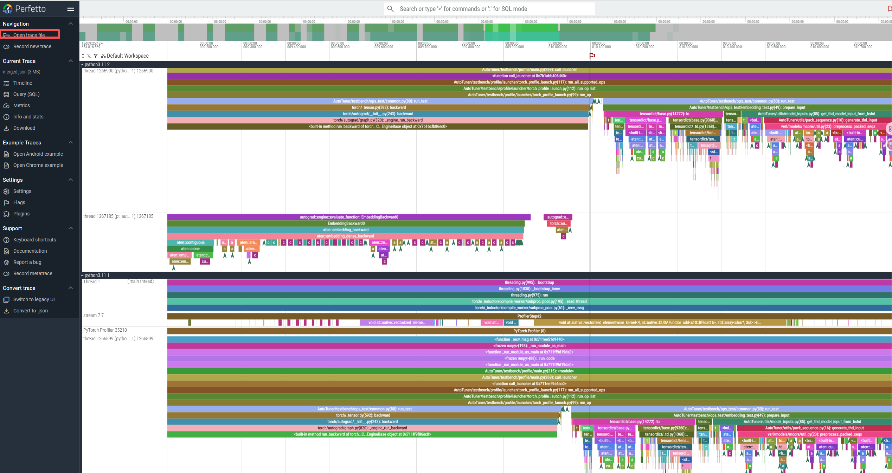

## 📊 How to Merge PyTorch Profiler Results from Multiple Ranks

During multi-GPU (multi-rank) training, Megatron-LM generates separate profiler trace files (`.json`) for each rank.  
To visualize all ranks together in a single timeline using Perfetto — **so you can observe computation imbalance and communication bubbles** — you can merge these files using:

```
tools/merge_profiler_traces.py
```

---

### 🧰Usage

You can view the full script options using:

```bash
python3 tools/merge_profiler_traces.py -h
```

Output:

```
usage: merge_profiler_traces.py [-h] [-i INPUT_DIR] [-o OUTPUT_FILE]

Merges Profiler JSON trace files.

options:
  -h, --help            show this help message and exit
  -i INPUT_DIR, --input_dir INPUT_DIR
                        Directory containing profiler .json files.
  -o OUTPUT_FILE, --output_file OUTPUT_FILE
                        Merged JSON output filename. If only a filename is 
                        specified, it is saved to the parent directory of the 
                        input path.
```

---

### 🚀 Example

```bash
python3 tools/merge_profiler_traces.py \
    -i outputs/2025-10-19_23-52-57/Qwen/Qwen3-0.6B/torch_profiler
```

Example output:

```
Input Directory: outputs/2025-10-19_23-52-57/Qwen/Qwen3-0.6B/torch_profiler
Output File: outputs/.../torch_profiler_merged.json
Found 2 JSON files. Starting processing...
--- Reading file: ...Rank 1...
  Processing 5007 events...
--- Reading file: ...Rank 0...
  Processing 5007 events...

==============================
 Merge successful! Processed 2 Ranks.
 Output file saved to: .../torch_profiler_merged.json
 You can now upload this file to https://ui.perfetto.dev/ for visualization.
==============================
```

---

### 🔍 Visualizing the Merged Trace with Perfetto

1. Open **Perfetto UI**:  
    [https://ui.perfetto.dev/](https://ui.perfetto.dev/)
    
2. Click **“Open trace file”**
    
3. Select the generated `torch_profiler_merged.json`
    

You will now be able to view events from all ranks on a single timeline.
